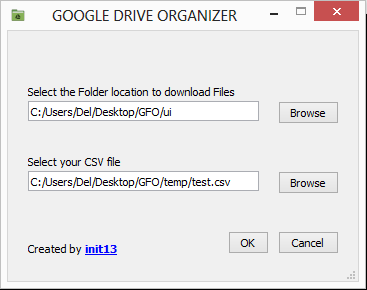

# GOOGLE DRIVE ORGANIZER

An interactive GUI guided program to automatically create/organize folders of all entries as per selected requirements and downloads the uploaded documents into these seperate folders.

Store the collected documents through Google Forms into Local Machine.

 
# Tech Stack: 
1.Python

2.PyQt5

3.GoogleAPI

---
 
## To Start ->

> python Requirement.py

> python main.py

## or 

> py -m main.py

